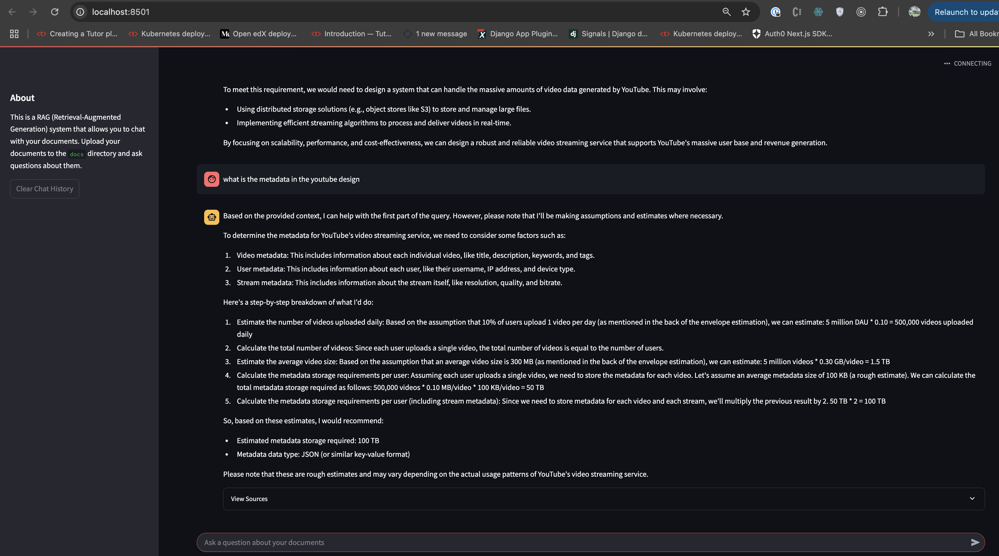
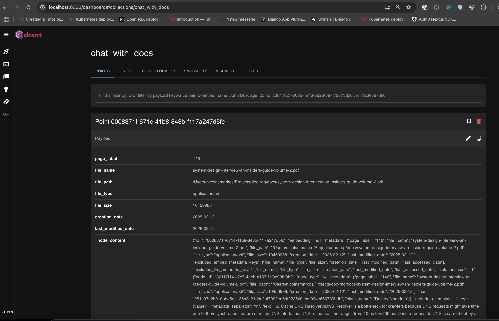

# Document RAG System 📚

A Retrieval-Augmented Generation (RAG) system built with LlamaIndex that allows you to chat with your documents.

## Features

- 🔍 Document indexing and semantic search
- 💬 Interactive chat interface with Streamlit
- 🤖 Local LLM support via Ollama
- 🗄️ Vector storage with Qdrant
- 🔄 Source attribution for responses

## Prerequisites

- Python 3.10+
- Poetry for dependency management
- Docker for running Qdrant
- Ollama for local LLM support

## Installation

1. Clone the repository:

```
git clone https://github.com/Markonick/doc-rag.git
cd doc-rag
```

2. Install dependencies with Poetry:

```
poetry install
```

3. Start Qdrant (in a separate terminal):

```
make qdrant
```

4. Start Ollama (in a separate terminal):

```
make ollama
```

## Usage

1. Place your PDF documents in the `docs` directory.

2. Start the Streamlit interface:

```
make streamlit
```

3. Open your browser and navigate to `http://localhost:8501`
   
   
   


4. To inspect your local qdrant ector store, go to `http://localhost:6333/dashboard#/collections`
   

    


## Project Structure
```
.
├── app.py # Main application code
├── config.py # Configuration classes
├── docs/ # Directory for your documents
├── pyproject.toml # Poetry dependencies
├── Makefile # Command shortcuts
└── README.md # This file
```


## Configuration

The system can be configured through the `config.py` file:

- Document settings (input directory, file extensions)
- Vector store settings (host, port, collection name)
- Model settings (embedding model, LLM model, parameters)

## Development

This project uses:

- [LlamaIndex](https://www.llamaindex.ai/) for RAG pipeline
- [Qdrant](https://qdrant.tech/) for vector storage
- [Ollama](https://ollama.ai/) for local LLM
- [Streamlit](https://streamlit.io/) for the user interface


## License

[MIT License](LICENSE)

## Contact

Your Name - nicolas.markos@gmail.com | nicolas.markos@bytewilds.com

Project Link: [https://github.com/Markonick/doc-rag.git](https://github.com/Markonick/doc-rag.git)